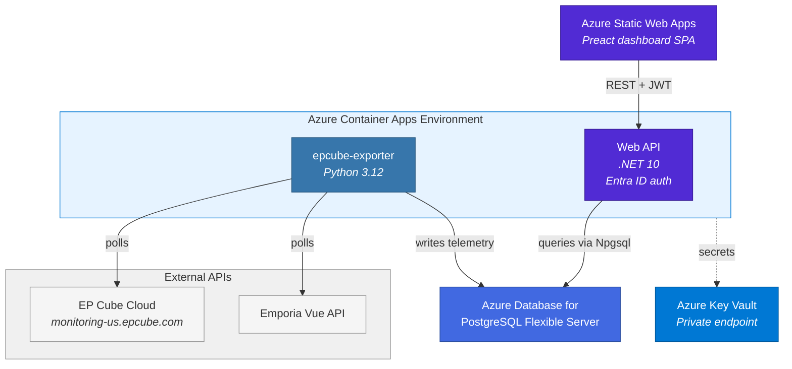

#### _**This project was coded entirely by Github Copilot using Claude Opus 4.6 and the Spec-Driven Development framework.  I guided the architecture and provided the requirements but did not edit a single line of code by hand, except for this paragraph. 😉**_

# EP Cube Graph

A full-stack energy monitoring system for **Canadian Solar EP Cube** solar/battery gateways and **Emporia Vue** circuit-level monitors. Collects real-time telemetry, stores it in PostgreSQL, and presents it through an interactive web dashboard.


---

## Architecture



### Data Flow

1. **Ingest** — A Python exporter polls the EP Cube cloud API and Emporia Vue API on configurable intervals, writing telemetry directly to PostgreSQL.
2. **Store** — PostgreSQL stores all time-series data with indefinite retention. Device metadata, panel hierarchy, and display name overrides are stored alongside.
3. **Serve** — An ASP.NET Core Minimal API queries PostgreSQL via Npgsql and exposes clean JSON endpoints. All data endpoints require Entra ID JWT authentication with a `user_impersonation` scope.
4. **Visualize** — A Preact SPA authenticates via MSAL.js (PKCE), renders real-time gauges and historical charts with uPlot, and auto-polls the API every 30 seconds.

---

## Components

### Exporter (`local/epcube-exporter/`)

Python 3.12 daemon that collects telemetry from two sources:

- **EP Cube** — Solar generation, battery power/state, home load, grid import/export. Solves AJ-Captcha block puzzles for authentication.
- **Emporia Vue** — Circuit-level power monitoring with daily kWh rollups.

All data is written directly to PostgreSQL via psycopg2. Background thread loops are hardened with full try/except wrapping and structured logging.

### API (`api/`)

ASP.NET Core Minimal API on .NET 10:

| Endpoint | Auth | Purpose |
|----------|------|---------|
| `GET /api/v1/health` | No | Datastore connectivity check |
| `GET /api/v1/readings/current` | Yes | Latest reading per device for a metric |
| `GET /api/v1/readings/range` | Yes | Bucketed time-series with configurable step |
| `GET /api/v1/devices` | Yes | Device inventory |
| `GET /api/v1/grid` | Yes | Grid power time-series |
| `GET /api/v1/settings` | Yes | Runtime configuration |
| `PUT /api/v1/settings/{key}` | Yes | Update setting (allowlisted keys) |
| `GET /api/v1/settings/hierarchy` | Yes | Panel hierarchy entries |
| `PUT /api/v1/settings/hierarchy` | Yes | Update panel hierarchy (cycle detection) |

### Dashboard (`dashboard/`)

Preact SPA (~3 KB framework) with:

- **Current Readings** — Real-time gauges for solar, battery, home load, and grid power
- **History View** — Interactive time-series charts (uPlot) with configurable ranges
- **Flow Diagram** — Live energy flow visualization with circuit overlay
- **Circuits Page** — Per-circuit power monitoring with panel grouping and daily kWh
- **Settings Page** — Runtime configuration for polling intervals and panel hierarchy

### Infrastructure (`infra/`)

Terraform IaC (azurerm ~4.0, azuread ~3.0):

- **Azure Container Apps** — API and exporter runtime with managed identity
- **Azure Database for PostgreSQL** — Flexible Server on a private subnet
- **Azure Static Web Apps** — Dashboard hosting with custom domain
- **Azure Key Vault** — Secrets management via private endpoint
- **Azure Application Insights** — Telemetry for API and dashboard
- **VNet** — Private networking with dedicated subnets for infrastructure, PostgreSQL, and endpoints

---

## Security

### Authentication & Authorization

- **API** — Microsoft Entra ID JWT validation via Microsoft.Identity.Web. All data endpoints require a valid bearer token with the `user_impersonation` scope.
- **Dashboard** — MSAL.js with Authorization Code flow (PKCE). No client secrets in the browser.
- **Exporter** — OAuth2 client credentials for Vue API access. Credentials stored in Azure Key Vault.

### Zero-Trust Infrastructure

Every component follows zero-trust principles — no resource has a public endpoint unless it serves end users.

- **PostgreSQL** — Private subnet with private DNS zone. No public endpoint. Accessible only from the Container Apps VNet.
- **Key Vault** — Public network access permanently disabled. Accessed exclusively via private endpoint from the runner and Container Apps.
- **Terraform state** — Azure Blob Storage with public access disabled. Accessible only via private endpoint from the self-hosted GitHub Actions runner.
- **Self-hosted runner** — Azure VM (B2s) with no public IP and no SSH access. Managed exclusively via `az vm run-command`. The only component that can reach state storage and Key Vault.
- **Container registry** — No admin credentials. Accessed via managed identity with AcrPull role assignment.
- **Container Apps** — Run inside a VNet-integrated environment on a dedicated infrastructure subnet.

### Supply Chain

- **Dependabot** — Automated vulnerability scanning for all dependencies.
- **GitHub Advanced Security** — Enabled for secret scanning and dependency alerts.
- **No `:latest` tags** — All container images use pinned versions in production.

---

## Development

### Prerequisites

- .NET 10 SDK
- Node.js 22+
- Python 3.12
- Docker & Docker Compose
- Terraform ≥ 1.5

### Running Locally

```bash
# Start exporter + PostgreSQL (real data)
cd local
docker compose -f docker-compose.prod-local.yml up -d

# Start API
cd api/src/EpCubeGraph.Api
dotnet run                          # http://localhost:5062

# Start dashboard
cd dashboard
npm install && npm run dev          # http://localhost:5173
```

### Testing

```bash
# API — 391 tests, 100% line + branch coverage
cd api && dotnet test EpCubeGraph.sln

# Dashboard — 544 tests, 100% statement/branch/function/line coverage
cd dashboard && npm run typecheck && npm run test:coverage

# Exporter — 177 tests
cd local/epcube-exporter && python -m pytest test_exporter.py
```

100% coverage is enforced by project policy across all components.

### CI/CD

- **CI** (`ci.yml`) — Runs on every push. Builds, tests, and validates all components.
- **CD** (`cd.yml`) — Deploys to staging (branch environments) or production (main). Includes Terraform plan/apply, container builds, and post-deploy validation.
- **Self-hosted runner** — Azure VM (B2s) with no public IP, private endpoint access to state storage and Key Vault.

---

## Project Structure

```
api/                        .NET 10 API (src/ + tests/)
dashboard/                  Preact SPA (src/ + tests/)
infra/                      Terraform IaC
  bootstrap/                Bootstrap module (RG, Key Vault, runner PE)
local/                      Docker Compose stacks
  epcube-exporter/          Python exporter
  mock-exporter/            Mock metrics server for automated tests
scripts/                    Setup and operational scripts
specs/                      Feature specifications and checklists
.github/workflows/          CI/CD pipelines
```

---

## Tech Stack

| Layer | Technology | Version |
|-------|-----------|---------|
| Ingestion | Python + psycopg2 + PyEmVue | 3.12 |
| Storage | PostgreSQL | 17 |
| API | ASP.NET Core + Npgsql | .NET 10 |
| Dashboard | Preact + uPlot + MSAL.js | 10.x |
| Build | Vite | 6.4 |
| Testing | xUnit + Testcontainers (API), Vitest (Dashboard), pytest (Exporter) | — |
| Infrastructure | Terraform (azurerm ~4.0) | ≥ 1.5 |
| Cloud | Azure Container Apps, PostgreSQL Flex, Static Web Apps, Key Vault | — |
| Auth | Microsoft Entra ID | — |
| CI/CD | GitHub Actions | — |
